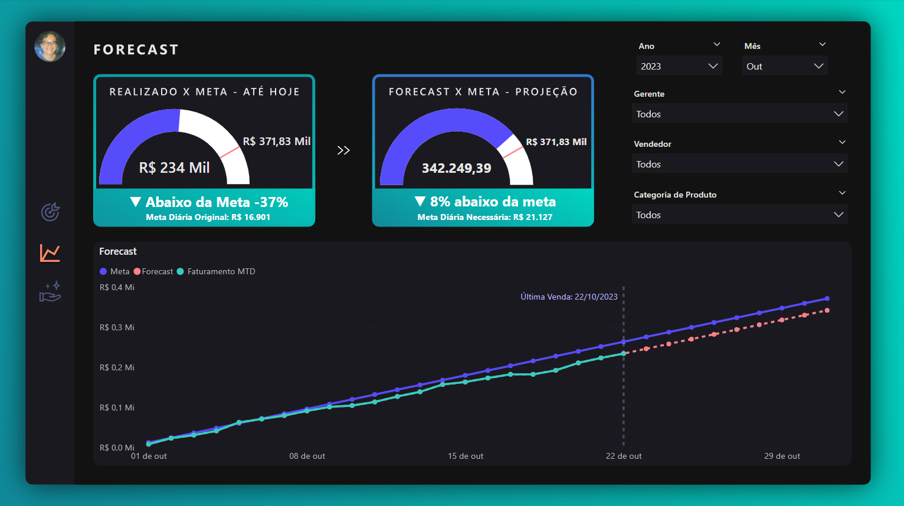
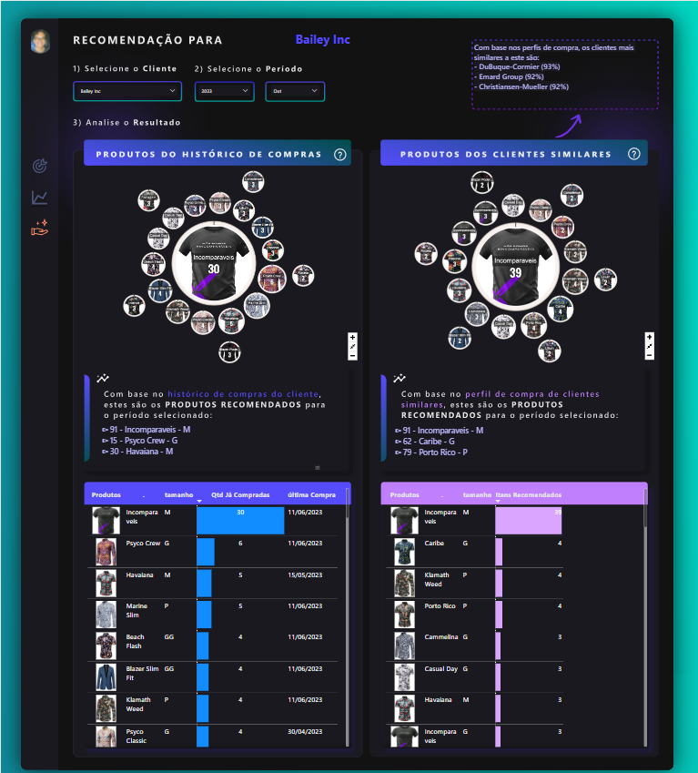

# 📊 Análise Comercial Varejista – Pinski Moda

## 💡 Cenário

O diretor de vendas da loja **Pinski Moda** enfrentava sérias dificuldades para acompanhar as metas e o desempenho da equipe. Os relatórios estavam espalhados em múltiplos arquivos Excel, gerando **atrasos**, **erros** e **falta de visão estratégica**. Foi nesse cenário que entrei com uma solução de **Business Intelligence completa**.

---

## 🎯 Desafio

> **Case:** Ajude o gestor da Pinski Moda a superar o caos de suas planilhas!  
> Neste desafio, criamos o acompanhamento de metas mensais, analisamos o desempenho da equipe de vendas, avaliamos a performance dos produtos e implementamos um sistema de **Recomendação de Produtos**.

---

## ✅ Entregas

### Página 1 – Visão Geral Comercial

- Quatro cartões: **Faturamento**, **Faturamento vs Meta**, **Notas Fiscais Emitidas**, **Ticket Médio**
- Gráfico de colunas: **Faturamento Mensal vs Meta**
- Gráfico de barras: **Faturamento por Gerente e Supervisor**
- Gráfico de barras: **Faturamento por Produto**
- Tabela: **Vendedores que bateram ou não bateram a meta**

---

### Página 2 – Projeção & Forecast

- Gráfico de linha: **Meta x Realizado x Forecast**
- Velocímetro: **Realizado vs Meta**
- Velocímetro: **Projeção Final vs Meta (o quanto ainda falta para bater a meta)**

---

### Página 3 – Sistema de Recomendação de Produtos

- Tabela: **Análise de Cesta (Produtos que o cliente já comprou + recomendações de outros produtos)**
- Tabela: **Clientes Similares (recomendações com base em perfis parecidos)**

---

## ⚙️ Tecnologias e Abordagens Utilizadas

- **Power BI Avançado** com Power Query (granularização de metas em dias úteis, tratamento de dados)
- **SQL** para extração dos dados do banco de dados relacional
- **Python** para criação do sistema de recomendação baseado em análise de cestas (market basket analysis)
- **Modelagem de dados** e relacionamento entre tabelas normalizadas

---

## 💬 Valor da Análise

> Esse tipo de projeto, com visual estratégico, inteligência aplicada e automações, é facilmente **avaliado em mais de R$ 3.000,00** no mercado.  
> Aqui, além da entrega visual, foi construída uma **base sólida e escalável para decisões ágeis** e com dados reais.

---

## 🧠 Insight Final

> De relatórios caóticos e demorados para um painel inteligente, dinâmico e visual.  
> Agora, o diretor da Pinski Moda **não precisa mais esperar relatórios**: ele **vê tudo em tempo real** e toma decisões com base em dados — **não em achismos**.

